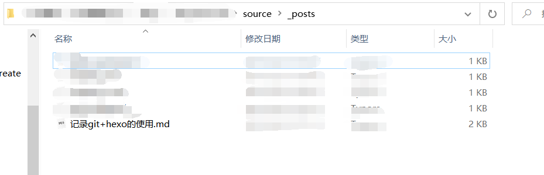

初初见面，以后还请多多指教。

<!-- more -->

## git

### 1.初始化本地仓库

~~~bash
git init
~~~

### 2.添加内容到缓存区

~~~bash
git add [filrpath]
#添加所有文件到缓存区
git add . 
~~~

### 3.提交暂存区文件到本地仓库

~~~bash
git commit -m '操作详情' 
~~~

### 4.额外内容

>远程仓库关联操作

~~~bash
#添加远程仓库关联，命名一般为origin
git remote add origin <url>
#后续提交和拉取操作需要配置远程仓库和本地分支状态
#拉取远程仓库到本地master分支
git pull origin master 
#提交同理
git push origin master
~~~

## hexo

### 1.初始化

~~~bash
#初始化博客项目
hexo init blog
~~~

### 2.使用

~~~bash
#安装git部署插件
npm install hexo-deployer-git --save
#将hexo的命令加载到全局
npm install -g hexo-cli 
~~~

> 没有使用全局的情况下

查看package.json文件查询命令

~~~json
{
  "name": "hexo-site",
  "version": "0.0.0",
  "private": true,
  "scripts": {
    "build": "hexo generate",
    "clean": "hexo clean",
    "deploy": "hexo deploy",
    "server": "hexo server"
  },
  "hexo": {
    "version": "4.1.1"
  },
  "dependencies": {
    "hexo": "^4.0.0",
    "hexo-deployer-git": "^2.1.0",
    "hexo-generator-archive": "^1.0.0",
    "hexo-generator-category": "^1.0.0",
    "hexo-generator-index": "^1.0.0",
    "hexo-generator-tag": "^1.0.0",
    "hexo-renderer-ejs": "^1.0.0",
    "hexo-renderer-marked": "^2.0.0",
    "hexo-renderer-stylus": "^1.1.0",
    "hexo-server": "^1.0.0"
  }
}

~~~

使用npm脚本操作

~~~bash
#npm执行脚本
npm <script>
#npx执行
npx hexo <dependencies>
~~~

hexo操作

将写好的md文件放在**source\\_posts\\**路径下

执行相应脚本

~~~bash
hexo g
hexo d
#修改预览
hexo s -- debug
~~~

脚本命令一览

~~~bash
hexo n "我的博客" == hexo new "我的博客" #新建文章
hexo g == hexo generate #生成
hexo s == hexo server #启动服务预览
hexo d == hexo deploy #部署

hexo server #Hexo会监视文件变动并自动更新，无须重启服务器
hexo server -s #静态模式
hexo server -p 5000 #更改端口
hexo server -i 192.168.1.1 #自定义 IP
hexo clean #清除缓存，若是网页正常情况下可以忽略这条命令
~~~

